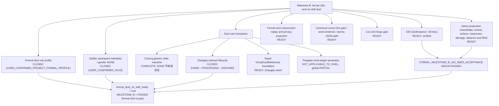

# MILESTONE_B_DEPENDENCY_GRAPH

## 文档身份与固定基线

本文件是 `MILESTONE_B_FORMAL_160_CARD_NO_SKILL_DUEL_ADVANCEMENT` 的当前状态依赖图。它不是 whole-repo audit 的续写，不是 `remediation-7`，也不改变任何已封存审计结论。

| 字段 | 当前事实 |
|---|---|
| 开发分支 | `sol-ultra-milestone-b-formal-duel` |
| 本轮实现基线 | `2ed9627ba816e9ab5023bd3017ce7cca90ec0022`（`feat: advance formal 160-card duel infrastructure`，已创建并推送远程） |
| 开始时工作树 | clean |
| 开始时 unmerged | empty |
| 当前 Git 写入状态 | 【CURRENT LIVE】R2 实现提交 0793c819ad45cc21328fad7d8afa6882d6197613（fix: close milestone B remediation 2 correctness gaps，父提交 8ce4970...）已提交；【Remediation 3 工作树】本轮修复未提交（PRECOMMIT） |
| 当前里程碑状态 | `formal_duel_no_skill_ready=true`（静态执行资格）；`MILESTONE_B=PASSED`（正式160张无技能单挑范围）；remediation-1 re-audit=`MILESTONE_B_REMEDIATION_1_REAUDIT_FAILED`；remediation-2 re-audit=`MILESTONE_B_REMEDIATION_2_REAUDIT_FAILED`；Remediation 3 工作树=`PRECOMMIT`、`NOT_AUDITED_YET` |

永久封存边界不变：original whole-repo audit 为 `WHOLE_REPO_AUDIT_FAILED`；R1 至 R5 为对应 remediation re-audit FAILED；R6 为 `REMEDIATION_6_REAUDIT_PASSED`；finalization correction verification 为 PASSED。不创建 R7，不移动旧审计分支或标签，不把 original FAILED 改写为 PASSED。

## 用户新确认规则（2026-08-09）

1. 丈八蛇矛材料生命周期：`USER_CONFIRMED_RULE`——两张材料牌从手牌构成虚拟普通【杀】时 `HAND→PROCESSING` 为权威牌移动；虚拟【杀】整个使用/打出与结算期间材料保持 PROCESSING；本次虚拟【杀】完整结算完成后 `PROCESSING→DISCARD`。不是 HAND→DISCARD 后再独立结算，也不是材料停留在 HAND。`VIRTUAL_CARD_SUBCARD_LIFECYCLE_RULE_GAP` 已关闭。
2. formal soldier profile：`USER_CONFIRMED_PROJECT_FORMAL_PROFILE`——formal 2-player no-skill duel；参与者 p1/p2，显示名“士兵”（固定无技能占位角色，`soldier`）；双方 `max_hp=4`、`initial_hp=4`、初始手牌4；先手由项目唯一 `DeterministicRNG` 决定；首回合正常完整回合规则、DRAW 正常摸2；无手气卡；无武将技能；无身份/主公技；无模式奖励/击杀奖励；正式权威160张牌堆；一方死亡且无法被合法救援后另一方立即获胜，game over 后不启动新回合。
3. effective gender `NONE`（GENDERLESS）是合法规则状态：任何要求角色为男性/女性、或比较双方性别的效果不得把 NONE 当作男或女，两个 NONE 不构成“异性”。`CharacterGender.NONE` 与“资料未确认（gender=None）”严格区分。formal duel 双方士兵 `effective gender=NONE`，因此雌雄双股剑不因“异性”发动（其 global production semantics 保持 COMPLETE，未降级）。

## 现场派生快照（live readiness，工作树）

| 指标 | 当前值 | 含义 |
|---|---:|---|
| `deck_count` | 160 | 正式 CSV 实体牌数量 |
| `registered_card_key_count` | 38 | 已注册卡牌类别 |
| `registered_instance_count` | 160 | 已注册实体数量 |
| global COMPLETE | 37 类 / 159 实体 | 方天画戟仍为 global PARTIAL |
| duel-scope sufficient | 38 类 / 160 实体 | 方天多人附加目标在严格两人范围为 NOT_APPLICABLE_TO_DUEL |
| `mode_runtime_reachable` | true | formal factory 可到达同一生产核心 |
| `mode_implemented` | true | 正式 profile 与参与者元数据来源已关闭 |
| `all_cards_implemented` | true | duel-scope 全部卡牌语义充分（含丈八） |
| `reexecution_replay_supported` | true | 严格逐步重执行已接入 |
| `unsupported_rules` | 0 | 正式单挑上下文无规则缺口 |
| `approximation_count` | 0 | 无近似替代 |
| `acceptance_seed_count` | 100 | 正式 100-seed 验收已现场加载 |
| `fixed_seed_acceptance_passed` | true | seeds 0..99 全部自然结束且严格重执行通过 |
| `formal_duel_no_skill_ready` | true | 正式无技能单挑门禁开放 |
| `formal_run_ready` | true | 正式单挑 runner 就绪（status exit 0） |
| blockers | 空 | 无剩余 formal duel blocker |

全局门禁保持：`authoritative_full_game_core=false`（正式整局引擎仍未完成）、`multi_player_production_proven=false`、`unsupported_rules=1`（完整整局哨兵）——见“门禁语义”一节。

## 依赖关系

## 实现落地摘要

1. 丈八蛇矛：材料生命周期改为 `HAND→PROCESSING`（`_move_zhangba_materials_to_processing`）与结算完成后 `PROCESSING→DISCARD`（`_finalize_zhangba_materials`）；PLAY 主动使用、决斗/南蛮打出、借刀要求使用均接入；被闪、造成伤害、无效/防具无效、防止、角色死亡等所有正常结束路径统一清理；响应链期间材料保持 PROCESSING；duplicate/stale/forged/atomic 失败关闭；不产生 CARD_DISCARDED；事件语义保持 CARD_USED/CARD_PLAYED 区分。丈八 `WEAPON_SKILL_STATUS=COMPLETE`；虚拟杀动作携带类型化 `VirtualCardReference`，公共枚举器校验材料存在且不重复，未恢复全局 `virtual:` 豁免。
2. gender 模型：`CharacterGender.NONE`（无性别/当前视为无性别）加入权威枚举；`is_cixiong_opposite_gender_target` 对任一方 NONE 恒返回 False（不构成异性），`gender=None`（资料未确认）仍严格失败关闭；`CharacterMetadata.intrinsic_gender` 与 `PlayerState.character.gender`（当前有效/规则可见）沿用现有可扩展结构，未来国战“底层固有性别＋当前有效 NONE”可表达。
3. formal soldier profile：`FormalDuelConfiguration.formal_profile()`（source_confirmed=true）；`_FORMAL_EXECUTION_RELEASED=True`；非 analysis 会话仅接受 canonical formal profile（调用方配置不能自我授权）；replay 正式结果绑定 canonical profile 校验。
4. 正式验收：`scripts/sgs_formal_milestone_b_acceptance.py` 以 formal profile、analysis_only=false、seeds 0..99、max_steps=2000 逐局执行并 strict replay 重执行，输出 `docs/FORMAL_MILESTONE_B_100_SEED_ACCEPTANCE.json`（逐 seed 记录 seed/winner/action_count/reshuffle_count/unsupported_rules/approximation_count/strict_reexecution/final_state_hash）。live readiness 从该 artifact 现场加载证据（缺失/损坏/含失败 seed 时 fail-closed 回 0/false）。

## 门禁语义（防止混写）

1. `formal_duel_no_skill_ready=true` 与 `MILESTONE_B=PASSED` 只表示“正式160张无技能双人单挑”这一明确范围真实完成（100-seed 固定验收、严格重执行、牌守恒、隐私不变量均现场通过）。
2. 这不意味着完整游戏引擎完成：`authoritative_full_game_core=false`（正式整局入口仍未接入权威回合循环）、`multi_player_production_proven=false` 保持；`unsupported_rules=1`（完整整局哨兵）保持。
3. `MILESTONE_B_ANALYSIS_SEED_DIAGNOSTIC`（docs/MILESTONE_B_ANALYSIS_SEED_DIAGNOSTIC.json）仍是 analysis-only 历史诊断，不得改写成正式 acceptance；正式证据只来自 `docs/FORMAL_MILESTONE_B_100_SEED_ACCEPTANCE.json`。

## 验证证据（implementation/regression evidence，非独立审计结论）

- 完整 `python -m pytest -q`：`2041 passed`，0 failed、0 skipped、0 xfailed（1170.71s）。
- `compileall` 通过；source integrity 122 文件 / defect 0 / audit_item 55；JSON/SHA-256（38 条目）mismatch=0；`git diff --check` 通过；`git ls-files -u` 为空。
- `FORMAL_MILESTONE_B_100_SEED_ACCEPTANCE`：100/100 自然结束，failures=0，safety-cap 0，unsupported 0，approximation 0，每局 strict reexecution 通过且 final_state_hash 记录。

## 剩余边界

1. 方天画戟 global PARTIAL（MULTIPLAYER/MULTI_TARGET_INFRASTRUCTURE_GAP）保持；duel-scope 为 NOT_APPLICABLE_TO_DUEL，不得虚报 global COMPLETE。
2. 正式整局入口（authoritative_full_game_core）仍未完成；完整里程碑的全局语义仍需后续批次。
3. 【CURRENT LIVE】R2 实现提交 0793c819... 已提交；remediation-1 re-audit=`MILESTONE_B_REMEDIATION_1_REAUDIT_FAILED`、remediation-2 re-audit=`MILESTONE_B_REMEDIATION_2_REAUDIT_FAILED`；Remediation 3 工作树=`PRECOMMIT`、`NOT_AUDITED_YET`；不得预写 Remediation 3 审计 PASSED、未来 commit SHA 或 milestone tag；Remediation 3 工作树修改未提交。
