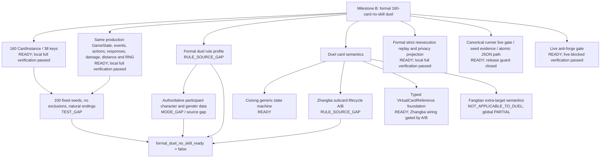

# MILESTONE_B_DEPENDENCY_GRAPH

## 文档身份与固定基线

本文件是 `MILESTONE_B_FORMAL_160_CARD_NO_SKILL_DUEL_ADVANCEMENT` 的当前状态依赖图，记录从真实工作树继续开发所需的依赖与阻塞。它不是 whole-repo audit 的续写，不是 `remediation-7`，也不改变任何已封存审计结论。

| 字段 | 当前事实 |
|---|---|
| 开发分支 | `sol-ultra-milestone-b-formal-duel` |
| 固定基线 | `4c8c4466f1950740c69767a01a0b24cab723b310` |
| 基线提交说明 | `docs: correct finalization governance residuals` |
| 开始时工作树 | clean |
| 开始时 unmerged | empty |
| 当前 Git 写入状态 | 工作树存在未提交的 Milestone B 开发修改；`commit=null`，`pending` |
| 当前里程碑状态 | `formal_duel_no_skill_ready=false`；不得宣告 Milestone B PASSED |

永久封存边界如下：original whole-repo audit 为 `WHOLE_REPO_AUDIT_FAILED`；R1 至 R5 分别为对应 remediation re-audit FAILED；R6 为 `REMEDIATION_6_REAUDIT_PASSED`；finalization correction verification 为 PASSED。上述事实不在本轮修改范围内，不创建 R7，不移动旧审计分支或旧 milestone tag，也不把 original FAILED 改写为 PASSED。

## 现场派生快照

以下值来自当前工作树 canonical readiness inspector；它们是开发状态，不是独立审计结果，也不是最终验收结果。

| 指标 | 当前值 | 含义 |
|---|---:|---|
| `deck_count` | 160 | 正式 CSV 实体牌数量；本地全量验证通过 |
| `registered_card_key_count` | 38 | 已注册卡牌类别 |
| `registered_instance_count` | 160 | 已注册实体数量 |
| global COMPLETE | 36 类 / 158 实体 | 丈八蛇矛、方天画戟仍为 global PARTIAL |
| duel-scope sufficient | 37 类 / 159 实体 | 方天多人附加目标在严格两人范围为 N/A；丈八仍阻塞 |
| `mode_runtime_reachable` | true | analysis-only formal factory 可到达同一生产核心 |
| `mode_implemented` | false | 正式规则 profile 与参与者元数据来源未关闭 |
| `reexecution_replay_supported` | true | analysis-only formal 会话已接入严格逐步重执行 |
| `unsupported_rules` | 2 | 正式 profile 与丈八生命周期规则缺口 |
| `approximation_count` | 0 | 当前实现没有以近似替代缺失规则 |
| `acceptance_seed_count` | 0 | 尚未执行可计入正式验收的 100-seed 批次 |
| `all_cards_implemented` | false | duel scope 尚缺丈八 |
| `formal_duel_no_skill_ready` | false | 门禁保持关闭 |

## 依赖关系

“READY”在本文件中表示对应生产实现已经落地并纳入本轮 `2024 passed` 全量回归；本地 compileall、source integrity、JSON、SHA 与 live-blocked gate 复核亦已通过。它仍不表示缺失规则已确认、正式100-seed acceptance已通过或独立审计已经发生。

## READY

1. 正式牌堆通过现有 `FormalCardRegistry.from_formal_csv()` 加载真实 160 个实体、38 类卡牌；实体继续使用同一 `CardInstance` 和同一 `GameState`，没有测试小牌堆替代。
2. `FormalNoSkillDuelSession` 是 `ProductionBasicCardBatch` 的薄模式层，只参数化 mode ID、配置与参与者元数据；阶段、合法动作、事件、响应窗口、伤害、距离、濒死、胜负、洗牌和 `DeterministicRNG` 均复用同一权威核心，没有复制第二套引擎。`test_only_duel_vertical_slice` 没有被提升或复制到 formal mode。
3. analysis-only canonical factory 已可创建两人、160 张牌的 `formal_160_card_no_skill_duel` 会话；`FormalDuelReferenceController` 使用公开实体 ID 与稳定枚举顺序，不再用会话秘密派生的 action ID 作为同级决策依据。
4. `CharacterMetadata` 与 `CharacterGender` 已进入通用玩家数据模型并绑定 canonical state snapshot；没有硬编码“p1 男、p2 女”。未知元数据和未知性别保持显式失败关闭。
5. 雌雄双股剑通用生产状态机已落地并在全局/duel 卡牌语义中标为 COMPLETE：覆盖发动或放弃、异性目标二选一、无可弃牌时仅允许令攻击者摸牌、手牌隐藏 handle、装备弃置、白银狮子离区恢复、防具在选择结束后按最新状态求值、借刀强制杀根窗口衔接、严格回放与 player-visible 隐私。formal mode 仍须装配有来源的角色性别，见 MODE_GAP。
6. formal replay 已使用模式绑定的 canonical factory 重建同一生产会话并逐动作重执行；formal 记录拒绝 fixture 注入，不能用测试夹具伪造正式初态。
7. player-visible 投影已处理非行动者决策、隐藏手牌 handle 与弃牌阶段选择元数据，并重算公开 context hash；omniscient 记录仍保留权威审计材料。
8. 摸牌、公开展示、延时锦囊判定和八卦阵判定已复用同一弃牌堆重洗事务。事务真实移动实体而非仅重排牌堆顺序；正向重洗与牌堆/弃牌堆均空的原子失败边界已有回归覆盖。
9. formal gate 对精确 mode ID 每次现场调用 canonical readiness inspector，并固定检查仓库内 `sgs_formal_runner.py`；调用者篡改 manifest/payload 的旧能力布尔值、牌堆数量、规则版本或来源路径不能授予准入资格。
10. formal status 入口已能返回现场派生的结构化 readiness；当前明确返回 blocked，而不是把 analysis-only 运行包装成正式结果。
11. 通用 `VirtualCardReference` foundation 已进入 `LegalAction`：typed `card_key`、`conversion_rule_id` 与材料实体 ID 显式分离，禁止和 physical `card_instance_id` 同时存在；材料实体存在性由公共枚举／校验层检查，引用进入 action ID 与 strict production／duel replay 序列化；事件层继续复用显式 `material_card_instance_ids`。`tests/test_sgs_engine_actions.py` 定向 18 passed，原独立 typed virtual-card `DATA_MODEL_GAP` 已关闭。
12. runner 的 future-ready 分支已实现 live gate 后的 canonical seeds 0..99 逐 seed 证据复检与原子 JSON 输出。当前规则、卡牌、正式 100-seed 与模块私有 release guard 前置条件未关闭，因此 live gate 在接触输出路径前失败关闭；这不是无条件拒绝占位。
13. analysis-only seeds 0..99 诊断已逐局落盘到 `docs/MILESTONE_B_ANALYSIS_SEED_DIAGNOSTIC.json`：100条全保留、无排除／重采样、55自然结束、45仅因既有 `UnsupportedRuleError` 失败关闭（丈八23、雌雄元数据22），safety-cap／非法动作／生产异常／其他异常均为0，全部 deck=160，联合到达38类牌。该结果关闭了本次诊断可观察到的非规则 seed blocker，但文件明确不是 formal acceptance。

## IMPLEMENTATION_GAP

当前没有独立于规则真值与验收证据的 runner／typed virtual-card foundation 缺口：

1. 丈八蛇矛具体 lifecycle integration 仍须在 A/B 规则源关闭后，把现有 `VirtualCardReference` 接到材料区域转换、响应／伤害根窗口与事件时序；这是 `RULE_SOURCE_GAP` 门禁下的后续接线，不再是独立 `DATA_MODEL_GAP`。旧 `virtual:*` 字符串仍不得作为 `card_instance_id`。
2. readiness 的 100-seed 验收字段当前保持 0/false。最终证据须由不可注入的 canonical 现场运行与严格重执行结果派生，不能通过调用方 payload 或静态布尔值填写；该项归入 `TEST_GAP`。
3. 模块私有 `_FORMAL_EXECUTION_RELEASED` 当前为 false。这是正确的失败关闭状态；只有规则 profile、卡牌 lifecycle 与正式 100-seed 全部关闭后才可改变，不是待绕过的实现缺陷。

## RULE_SOURCE_GAP

1. 丈八蛇矛的最小未决规则是两张材料牌的区域生命周期时点，当前 Knowledge 不能在以下两种语义间作出裁定：
   - A：两张手牌作为 subcard 进入 PROCESSING，虚拟【杀】结算后再进入弃牌堆；
   - B：两张手牌在虚拟【杀】开始结算前直接进入弃牌堆，且从不进入 PROCESSING。

   禁止从旧代码、测试或模型记忆反推 A/B；未确认前保持 `VIRTUAL_CARD_SUBCARD_LIFECYCLE_RULE_GAP`。
2. 尚无“正式 160 张无技能单挑”规则 profile 的已确认来源。至少需要确认平台/版本、160 张牌堆是否适用、初始手牌、初始及上限体力、先手与首回合规则、同将／手气卡规则、参与者选择及角色元数据来源。当前 `analysis_convention` 明确只是分析约定，`deck_applicable=false`，不能产生正式结果。
3. 雌雄双股剑牌面规则和通用状态机不再属于规则实现缺口；剩余问题是 formal profile 中角色身份与性别的权威来源，不能由座次猜测。

## DATA_MODEL_GAP

当前独立 `DATA_MODEL_GAP=NONE`：

1. 通用 `VirtualCardReference` 已建立 typed card key、conversion rule、材料实体集合、physical／virtual 互斥、材料存在性校验、action ID 与 strict replay 契约；事件继续使用统一 `material_card_instance_ids`，没有创建第二套实体或生命周期。丈八具体区域时序仍由 A/B `RULE_SOURCE_GAP` 门禁，不把“尚未接线”重复统计为数据模型缺口。
2. 通用 `CharacterMetadata`／`CharacterGender` 已落地并进入 canonical state snapshot，“没有性别字段”的 schema 缺口已经关闭；formal mode 尚没有经规则源确认的参与者角色数据集或装配数据，该剩余依赖属于 RULE_SOURCE_GAP／MODE_GAP。

## MODE_GAP

1. canonical formal factory 目前只允许显式 `analysis_only=true` 使用未确认 profile；正式 profile 不能构造为可产生正式结果的会话。
2. formal mode 尚不能从权威来源给两名参与者装配角色 key 与性别。性别在无技能模式中仍是雌雄双股剑的实际触发数据，不因“不启用武将技能”而变成 N/A。
3. `mode_runtime_reachable=true` 只证明薄模式层已接到统一生产核心；由于 profile/参与者来源未关闭，`mode_implemented=false`。
4. runner 的 status、live gate、逐 seed 证据复检与原子输出路径均已接线；当前 run 因上游 profile／卡牌／100-seed 与 release guard 失败关闭。不能把 future-ready 分支的内部测试等同于正式验收已经完成。

## TEST_GAP

1. 本轮完整 `python -m pytest -q` 已为 `2024 passed, 1 warning in 830.59s`（唯一 warning 是 `.pytest_cache` WinError5）；compileall exit0；source integrity扫描125文件、117项（formal56/test61）、defect0；manifest／诊断JSON、seed IDs 0..99、Git-normalized SHA 47/47与diff-check均通过。这里不再有本地回归／完整性 TEST_GAP。
2. 正式验收所需固定 seeds 0..99 尚未运行；当前 acceptance 计数为 0。analysis-only 诊断虽已按同一 seed 集合逐项保留 winner、action count、turn/deck/reshuffle、unsupported、approximation、exception 与 safety-cap，但因 profile 未确认、formal eligible=0、reexecution verified=0，不能转记为 acceptance。
3. 正式100个 seed 必须全部自然结束；timeout、safety cap、exception、unsupported 或 approximation 任一出现都算失败。当前诊断仍有 unsupported总计145、approximation总计100和45个预期规则失败关闭，因此 `formal_acceptance_passed=false`；即使非规则诊断失败为0，也不能宣告 PASSED。
4. full suite 已覆盖本轮新增/扩展的 formal factory、Cixiong、replay/privacy、reshuffle、anti-forge与38类牌诊断可达性；真正缺口是规则关闭后由 canonical runner 产生100局全部自然结束且严格重执行通过的正式证据。

## DOC_GAP

1. `ENGINE_STATUS.md`、`IMPLEMENTATION_MATRIX.md`、`MASTER_IMPLEMENTATION_PLAN.md`、`CHECKPOINT_MANIFEST.json` 与 `SOURCE_AND_CALLCHAIN_AUDIT.md` 已同步当前实现、analysis-only seed诊断与最终本地验证事实；Git-normalized SHA表47个文件条目已现场重算并反验。不得预写独立审计 PASSED、未来 commit SHA 或 milestone tag。
2. 旧文档中“三个 PARTIAL、35 类/157 实体”等快照已被当前雌雄实现推进；最终同步时应区分 global 的 36/158 与 duel-scope 的 37/159，不得把方天 global PARTIAL 改写为 COMPLETE。
3. `SOURCE_AND_CALLCHAIN_AUDIT.md` 中旧审计时点的内容属于历史证据；如需记录新的 formal 调用链，应新增 Milestone B 当前状态段，不得改写封存结论。
4. 工作树尚未提交，所有新 checkpoint 的 `commit` 保持 `null`/`pending`；本轮已在最终文件稳定后计算 source SHA，不得回填未来 commit SHA。

## NOT_APPLICABLE_TO_DUEL

1. 方天画戟“使用最后一张手牌【杀】时增加额外目标”的多人附加目标语义，在恰好两名存活玩家的 duel 中没有第三名合法目标，因此该分支为 `NOT_APPLICABLE_TO_DUEL`。这允许方天在 duel 中按现有统一装备、距离与单一对手【杀】路径正确使用。
2. 上述 duel-scope 结论不能外推为全局 COMPLETE。方天画戟的多人/multi-target 生产语义仍为 global PARTIAL，未来多人模式仍须单独实现与验收。
3. 三人以上的目标选择与响应顺序不属于严格两人 duel 的触发空间；不得用两人测试证明这些全局多人语义。
4. 武将技能效果本身不属于 no-skill duel 验收范围；角色 key 与性别元数据仍适用，因为正式卡牌雌雄双股剑直接依赖它们。

## 最小外部确认依赖

当前可以继续推进的非规则工作不应因丈八而停止；但要关闭最终门禁，仍至少需要：

1. 对丈八蛇矛 subcard 生命周期选择并确认 A 或 B，附平台、版本、来源位置与允许的项目状态标签；
2. 提供或确认一份最小 formal duel profile，包括牌堆适用性、开局参数、先手/首回合规则及两名参与者角色 key 与性别的权威来源。

在以上确认及其后实现、全量测试、100-seed 与完整门禁均通过前，本文件结论保持 `MILESTONE_B_BLOCKED`。
